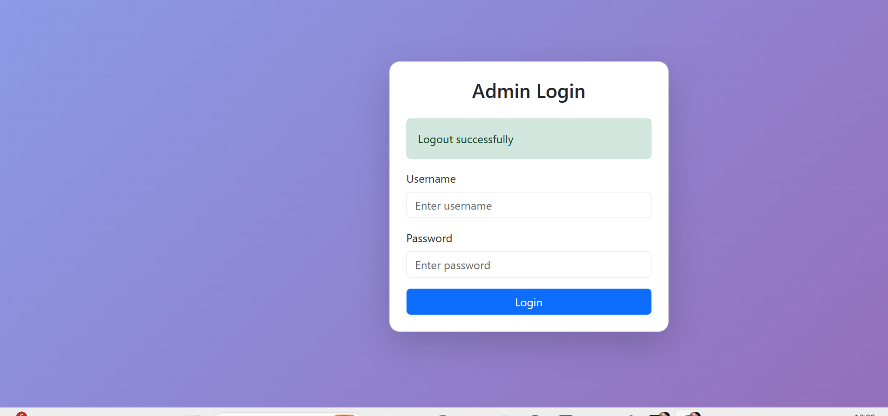

# 🚀 Admin Panel Management System

A **Django-based Admin Panel Management System** that supports hierarchical admin creation, role-based access control, and a centralized dashboard for managing users and roles.

This project demonstrates how a **Main Admin can create Sub-Admins, assign roles, and control access through permissions**.

---

# 📌 Features

✔ Dynamic Admin Creation
✔ Role-Based Access Control (RBAC)
✔ Hierarchical Admin Structure
✔ Dashboard for System Overview
✔ Secure Authentication System
✔ Admin & Sub-Admin Management
✔ Clean and Responsive Interface

---

# 🛠️ Technologies Used

| Technology      | Purpose             |
| --------------- | ------------------- |
| Python          | Backend programming |
| Django          | Web framework       |
| HTML            | Frontend structure  |
| CSS / Bootstrap | Styling             |
| SQLite          | Database            |

---

# 📂 Project Structure

```text
admin_panel_project/
│
├── admin_panel_project/      # Main Django project
│   ├── settings.py
│   ├── urls.py
│   ├── asgi.py
│   ├── wsgi.py
│
├── accounts/                 # Authentication and admin users
│
├── roles/                    # Role and permission management
│
├── dashboard/                # Admin dashboard views
│
├── templates/                # HTML templates
│
├── static/                   # CSS, JS, images
│
├── manage.py
│
└── README.md
```

---

# 📊 System Architecture

```
Main Admin
   │
   ├── Sub Admin Level 1
   │       │
   │       ├── Sub Admin Level 2
   │       │
   │       └── Assigned Roles
   │
   └── Dashboard Management
```

This structure allows **hierarchical control of administrators and roles**.

---

# 🖥️ Project Screenshots

## Login Page



## Admin Dashboard


## Role Management


---

# ⚙️ Installation Guide

### 1️⃣ Clone the Repository

```
git clone https://github.com/YOUR_USERNAME/admin_panel_project.git
```

### 2️⃣ Navigate to Project Folder

```
cd admin_panel_project
```

### 3️⃣ Create Virtual Environment

```
python -m venv venv
```

### 4️⃣ Activate Environment

Windows

```
venv\Scripts\activate
```

Linux / Mac

```
source venv/bin/activate
```

### 5️⃣ Install Dependencies

```
pip install -r requirements.txt
```

### 6️⃣ Run Migrations

```
python manage.py migrate
```

### 7️⃣ Create Superuser

```
python manage.py createsuperuser
```

### 8️⃣ Run Server

```
python manage.py runserver
```

Open:

```
http://127.0.0.1:8000
```

---

# 👨‍💻 Author

**Rinku Metaliya**
Computer Engineering Student
Government Engineering College Rajkot

LinkedIn
https://www.linkedin.com/in/gecr-comp220200107104

---

# 📜 License

This project is developed for **learning, academic, and internship purposes**.
